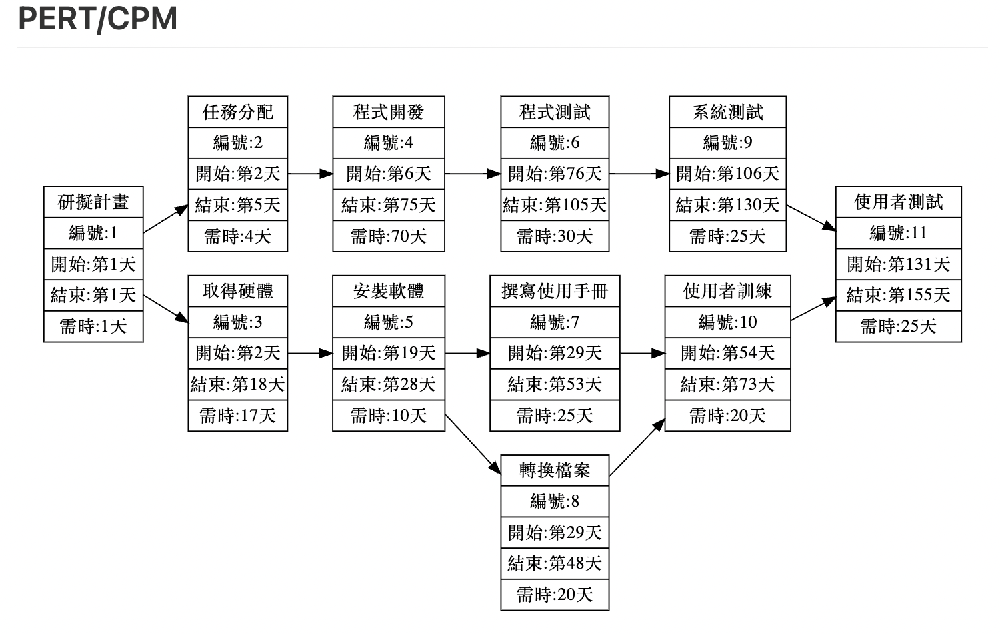

| **任務** | **說明** | **需時(天)**| **前置作業** |
|:--:|:----:|:---:|:---:|
| 1 | 研擬計畫 | 1 | - |
| 2 | 任務分配 | 4 | 1 |
| 3 | 取得硬體 | 17 | 1 |
| 4 | 程式開發 | 70 | 2 |
| 5 | 安裝軟體 | 10 | 3 |
| 6 | 程式測試 | 30 | 4 |
| 7 | 撰寫使用手冊 | 25 | 5 |
| 8 | 轉換檔案 | 20 | 5 |
| 9 | 系統測試 | 25 | 6 |
| 10 | 使用者訓練 | 20 | 7,8 |
| 11 | 使用者測試 | 25 | 9,10 |

![image](https://mermaid.ink/img/pako:eNqdV1tv40QY_SuRVysVyY1mfHcfe3uq4KEVT3mZ2OPEimMXZ7LbUFXiZVctFarEhsIKEKxAqEsrLgIEqLvwZzaX_gvGsV3P-JawEymp_Z1zvstcvumxYAU2FjaEDvIJadDR8qNv4hIPN2bjL2Znf0--uoxfxt8DbBE38Buzb8fTZzfzq9PZZ9exBU6-fxn9NjYQFCUgSesQrANZhHYZ_83t7eT8-eT06d2TT2KLkvElETkEhw0qpJSyJxeXk38-n724ubseJ971jC5ndKiX8mdX55NXF3eX57Pnr2KLDjK-kvIlUQfl_n86m3_39fz2m8w_w1dTvizS9zUBTP-6mb_8IbbIjICWCigifV8qMP30l8nP129e_zsbX03PzidPP47tkprJ6KmMKtL3pTLz12fTiy-nP46nL04TASYOgxWoSOS329kfv7KJsBGYqYBWGUGcwvyjJ_OrZ7M_fy8GAUEqoldGcS9SFQiEqYjJRRL_pkMQhT4O-8i16Z44jmwtgXRxH7eEDfqnjR009EhLEBnT-yh0UdvDgwhznOgKbWT1OmEw9O2Y-rjrEpwQI_th6PZRONoKvCCMEQ92tna2dncZDE0u8O0cyqHDZpVoUsTlQd2Bt2aAaO2Bh2LD1JqSrqjANIBsPnynGMRmENo4zPElhQpoEd-o5N8HWKqg3QvITVUyFQh1TdE5gTT2Ur6xPIAkgQN8RNgaQRnKAJQFmkcCOiRYElEOGHbaa2ZTBcmAtKqVT2yAnutj1p-8GJw_PiDeSleiv9nr1C-QDFBYG-1FXWFiNmUdbG8WzFJiRnRw3lEYBo-7GNm1GTiBT3ZR3_VGMaLVolmFuD20upg0-oPoWWw8wqGNfCQ2ot3i5ej77ofJDoPa4RFbPtTG3mZuKz3ARvRhYD5tYjVlWpgXqVYVwvKGAzrzNZVMEaxMoWDJ-bDn-r36SY_aa_WsY7uD91bLHFkk4IJabF3VbGqSBjVDkhTaguijrmuqrMlQMqL9pDdNAE0N6IYic_splquu5MKe2xptj0aZx-zx674T4hG7bt2Oj7zqAsT2g9qtES-N4IhGW3uI3uNKD7m3rtRCdkklvCA4XALxA4ILkRUX1gLGJ0oXqIrsHGb51LiPUNQwiz41TStH5twq0Yc7gz4YYt_C7w77bU4x3_GSVs3r0XMVrUEgRb1KihozvWiApmJyi9Ij-2XcJQ6krFAK1wwIGvSK-auy4rStPIxP3kAmsO0cJqr5ntvpkprQUtwKkG0U9mqmMIW9NyQD18YrILc81-pFFxS-78lQk_MTjg9WKw0D5gvUdizdcRhkJ3TZ7uFFdcodBnbgl0jVIvMR5nBW6JJiFo5j0JGH8asRc5Mb2GiUO8h4xOIQqJkCTBtomCuRqkp05EH5s66Asjw0GESoqiuO43rewegQg6qDMAXAqhaXAqTsfJSBsvwWmfLkjAeljFd5-Ut5CsPTtdX9qRlv_X-405gb5urOdCZIw6j0FtFOWv4J_UcCDUmwP_ItYYOEQywKw0MbEbztok6I-sKGg7zB_dsd26VNM0ae_Af2ocFN)](https://mermaid-js.github.io/mermaid-live-editor/edit#pako:eNqdV1tv40QY_SuRVysVyY1mfHcfe3uq4KEVT3mZ2OPEimMXZ7LbUFXiZVctFarEhsIKEKxAqEsrLgIEqLvwZzaX_gvGsV3P-JawEymp_Z1zvstcvumxYAU2FjaEDvIJadDR8qNv4hIPN2bjL2Znf0--uoxfxt8DbBE38Buzb8fTZzfzq9PZZ9exBU6-fxn9NjYQFCUgSesQrANZhHYZ_83t7eT8-eT06d2TT2KLkvElETkEhw0qpJSyJxeXk38-n724ubseJ971jC5ndKiX8mdX55NXF3eX57Pnr2KLDjK-kvIlUQfl_n86m3_39fz2m8w_w1dTvizS9zUBTP-6mb_8IbbIjICWCigifV8qMP30l8nP129e_zsbX03PzidPP47tkprJ6KmMKtL3pTLz12fTiy-nP46nL04TASYOgxWoSOS329kfv7KJsBGYqYBWGUGcwvyjJ_OrZ7M_fy8GAUEqoldGcS9SFQiEqYjJRRL_pkMQhT4O-8i16Z44jmwtgXRxH7eEDfqnjR009EhLEBnT-yh0UdvDgwhznOgKbWT1OmEw9O2Y-rjrEpwQI_th6PZRONoKvCCMEQ92tna2dncZDE0u8O0cyqHDZpVoUsTlQd2Bt2aAaO2Bh2LD1JqSrqjANIBsPnynGMRmENo4zPElhQpoEd-o5N8HWKqg3QvITVUyFQh1TdE5gTT2Ur6xPIAkgQN8RNgaQRnKAJQFmkcCOiRYElEOGHbaa2ZTBcmAtKqVT2yAnutj1p-8GJw_PiDeSleiv9nr1C-QDFBYG-1FXWFiNmUdbG8WzFJiRnRw3lEYBo-7GNm1GTiBT3ZR3_VGMaLVolmFuD20upg0-oPoWWw8wqGNfCQ2ot3i5ej77ofJDoPa4RFbPtTG3mZuKz3ARvRhYD5tYjVlWpgXqVYVwvKGAzrzNZVMEaxMoWDJ-bDn-r36SY_aa_WsY7uD91bLHFkk4IJabF3VbGqSBjVDkhTaguijrmuqrMlQMqL9pDdNAE0N6IYic_splquu5MKe2xptj0aZx-zx674T4hG7bt2Oj7zqAsT2g9qtES-N4IhGW3uI3uNKD7m3rtRCdkklvCA4XALxA4ILkRUX1gLGJ0oXqIrsHGb51LiPUNQwiz41TStH5twq0Yc7gz4YYt_C7w77bU4x3_GSVs3r0XMVrUEgRb1KihozvWiApmJyi9Ij-2XcJQ6krFAK1wwIGvSK-auy4rStPIxP3kAmsO0cJqr5ntvpkprQUtwKkG0U9mqmMIW9NyQD18YrILc81-pFFxS-78lQk_MTjg9WKw0D5gvUdizdcRhkJ3TZ7uFFdcodBnbgl0jVIvMR5nBW6JJiFo5j0JGH8asRc5Mb2GiUO8h4xOIQqJkCTBtomCuRqkp05EH5s66Asjw0GESoqiuO43rewegQg6qDMAXAqhaXAqTsfJSBsvwWmfLkjAeljFd5-Ut5CsPTtdX9qRlv_X-405gb5urOdCZIw6j0FtFOWv4J_UcCDUmwP_ItYYOEQywKw0MbEbztok6I-sKGg7zB_dsd26VNM0ae_Af2ocFN)
